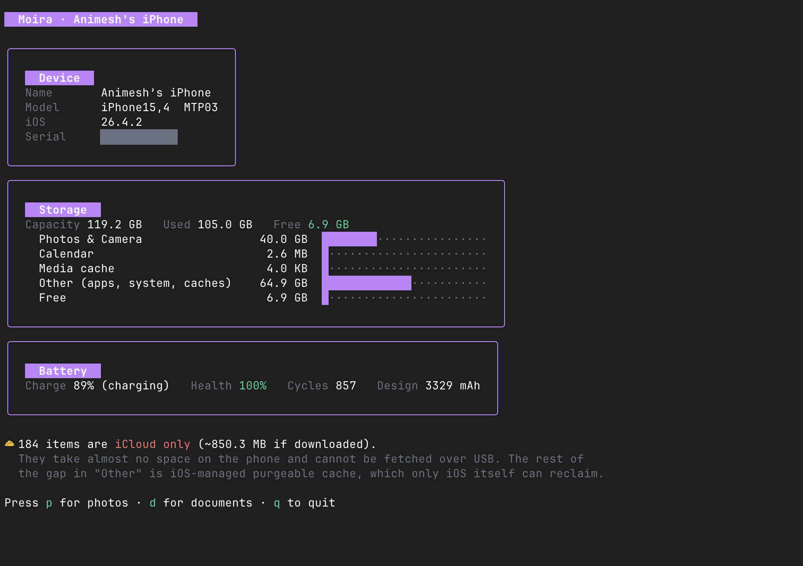

<h1 align="center">Moira</h1>

<p align="center">
  <strong>Get your photos off your iPhone without installing iTunes, iCloud, or a 200 MB Electron app.</strong>
</p>

<p align="center">
  One Go binary. USB only. It physically cannot delete anything on your phone.
</p>

<p align="center">
  <a href="#install">Install</a> ·
  <a href="#usage">Usage</a> ·
  <a href="#safety">Safety</a> ·
  <a href="#commands">Commands</a> ·
  <a href="#how-it-works">How it works</a>
</p>

<p align="center">
  
</p>

<p align="center">
  <em>Where your storage actually went, and how the battery is holding up — before you touch a file.</em>
</p>

---

## Features

- **Device dashboard first** — identity, a real storage breakdown, and battery health: charge, health %, cycle count, design capacity
- **Browse by album** — your actual albums and smart albums, read straight from the Photos library, with sizes and dates
- **Documents too** — books, PDFs, downloads and voice memos, not just camera roll
- **iCloud-aware** — offloaded photos are labelled `☁ iCloud only` up front instead of failing halfway through a 4,000-file export
- **Never overwrites** — a file already on disk with the right size is skipped; a different size is reported and left alone
- **Verified copies** — every file lands in a `.part`, gets size-checked against the library, and is renamed only if it matches
- **Read-only by construction** — the only device commands it can issue are `ls`, `info` and `get`
- **Single binary** — no daemon, no account, no phoning home, no cloud

> **Status: early.** Photos, videos and documents export. No deletion, no HEIC conversion, no Live Photo pairs yet.

## Why

Apple gives you two options for getting 40 GB of photos off a phone: pay for iCloud, or run Image Capture and hope. Everything else is a paid desktop app that also wants to manage your apps, your messages and your backups.

I wanted one job done well — **pick photos, copy photos, verify photos** — by something small enough to read in an afternoon and read-only enough that I'd trust it with irreplaceable files.

## Install

### Requirements

Moira drives Apple's own USB protocol via [libimobiledevice](https://libimobiledevice.org):

```bash
brew install libimobiledevice
```

That provides `idevice_id`, `ideviceinfo`, `idevicediagnostics` and `afcclient`. Then connect the iPhone over USB, unlock it, and tap **Trust This Computer**.

### From source

Requires Go 1.25+.

```bash
git clone https://github.com/AnimeshRy/moira
cd moira

make build          # → ./moira
./moira devices     # confirm the phone is visible
./moira
```

macOS is the tested platform; Linux should work wherever libimobiledevice does. Windows is untested.

## Usage

Start by checking the phone is paired, then just run it:

```bash
moira devices       # list connected devices
moira               # open the browser
moira info          # device, storage and battery as plain text
```

### The dashboard

Moira opens on the phone itself — the screenshot above. `p` opens **Photos**, `d` opens **Documents**.

### Exporting photos

Photos are grouped exactly as they are on the phone — your albums, plus the smart ones (All, Videos, Favorites, Recently Deleted). Pick an album, tick what you want, press `e`.

```console
  ▶ [✓] ♥ IMG_4821.HEIC              photo               2.4 MB  2026-08-14 19:02
    [✓]   IMG_4822.HEIC              photo               2.1 MB  2026-08-14 19:02
    [ ]   IMG_4823.MOV               video 12s          48.7 MB  2026-08-14 19:03
    [ ]   IMG_4109.HEIC              photo               1.9 MB  2026-07-02 11:20  ☁ iCloud only
```

Nothing is copied until you confirm:

```console
   Export?

   Moira will COPY these files to your Mac. Nothing on the iPhone is changed or deleted.
     2 items, 4.5 MB
     from  Animesh's iPhone
     to    /Users/you/Pictures/Moira/Summer 2026

   Existing files are never overwritten (same size = skipped).
   Items marked ☁ iCloud only are not on the phone and will be reported as failed.

   Press y to copy, any other key to go back.
```

Then a progress bar, then a summary that tells you the truth:

```console
   Done

     2 copied, 0 skipped (already there), 0 failed
     /Users/you/Pictures/Moira/Summer 2026

   Verify the files on your Mac before deleting anything on the phone.
```

Originals are exported as-is — HEIC stays HEIC, MOV stays MOV. There is no conversion and no re-encode.

### Exporting documents

`d` from the dashboard browses the non-photo parts of the phone that USB exposes: **Books**, **Downloads**, **Recordings** and **Podcasts**. Same keys, same confirmation, same never-overwrite rule.

```console
  Documents · /Books

    ·  Managed/                                    dir  2026-05-25
    ·  Purchases/                                  dir  2024-06-20
  ▶ [✓] The Pragmatic Programmer.epub          4.2 MB  2025-11-03
    [ ] receipts-2025.pdf                       318 KB  2026-01-08
```

Files land under `~/Pictures/Moira/Documents/<path on the phone>/`. Directories are listed and browsable, but not exported recursively.

### Choosing where files go

```bash
moira -out /Volumes/Backup/iPhone       # export somewhere else
moira -udid 00008120-001E05D01A39A01E   # skip the picker when two phones are plugged in
```

Photos go to `<out>/<Album>/`, documents to `<out>/Documents/<phone path>/`.

### Keys

| Key | Does |
|---|---|
| `p` / `d` | Photos · Documents (from the dashboard) |
| `enter` | Open the album or directory |
| `space` | Select / deselect |
| `a` | Select all / none |
| `/` | Filter by name |
| `e` | Export the selected items |
| `esc` | Back |
| `q` | Quit |
| `ctrl+c` | Stop mid-export — copied files are kept, the partial file is deleted |

## Safety

This is the part that matters, so it is not buried at the bottom of a wiki.

| | |
|---|---|
| **It cannot write to your phone** | The only device operations in the codebase are `afcclient ls`, `info` and `get`. There is no `put`, no `rm`, no `mkdir`. Nothing you do in the UI can reach a write. |
| **It cannot delete your photos** | Deletion is not implemented, anywhere, deliberately. Moira is for getting files *out* before you delete them yourself in the Photos app. |
| **It asks before copying** | Every export needs a literal `y`. There is no `--force`, no `--yes`. |
| **It never overwrites local files** | Same name and same size → skipped. Same name, different size → reported and left untouched. |
| **Partial downloads never masquerade as photos** | Each file is written to `name.part`, size-checked against the Photos library, and only then renamed. Interrupt it and you get no half-written HEICs. |
| **It tells you when something failed** | The summary counts copied, skipped and failed separately, and lists the failures. |

Verify the files on your Mac before deleting anything on the phone. Moira will not stop you from trusting it too early.

### On iCloud and "purgeable" space

Moira reports how many library items are iCloud-only, but **it cannot purge anything, and neither can any other USB tool**.

Those items are already offloaded — they use almost no space on the phone, which is the whole point of Optimize Storage. The large `Other` bucket is apps plus iOS-managed cache, which only iOS reclaims, on its own schedule, when the disk fills. Anything promising to "free up iPhone storage" over a cable is either deleting your files or lying.

## Commands

| Command | Description |
|---|---|
| `moira` | Open the interactive browser |
| `moira devices` | List connected, paired devices |
| `moira info` | Print device, storage breakdown and battery health as text |
| `moira -out DIR` | Set the export root (default `~/Pictures/Moira`) |
| `moira -udid UDID` | Target a specific device |

```console
$ moira info

Device     Animesh's iPhone (iPhone15,4, iOS 26.4.2, model MTP03)
Serial     XXXXXXXXXX
UDID       00008120-XXXXXXXXXXXXXXXX

Capacity   119.21 GB
Used       104.96 GB
Free       6.89 GB
  Photos & Camera              40.03 GB
  Calendar                     0.00 GB
  Media cache                  0.00 GB
  Other (apps, system, caches) 64.93 GB

Battery    89% charge, health 100%, 857 cycles, 3329 mAh design
```

## How it works

**Photos.** Moira copies `PhotoData/Photos.sqlite` — the same database Apple Photos uses — into `~/Library/Caches/moira/<udid>/` and reads it with a pure-Go SQLite driver. That is where albums, filenames, sizes, dates and iCloud availability come from. Files are then fetched individually from `DCIM/…` over AFC.

The album↔asset join table carries a schema version in its own name (`Z_33ASSETS` on one iOS release, something else on the next), so Moira discovers it at runtime instead of hardcoding it. iCloud availability comes from `ZINTERNALRESOURCE`, which is how an offloaded photo is spotted *before* the export starts rather than when the copy fails.

**Documents.** `afcclient ls` for names, one `afcclient info` per entry for size, type and modified time.

**Device stats.** `ideviceinfo` for identity, `com.apple.disk_usage.factory` for the storage categories, `com.apple.mobile.battery` for charge, and `idevicediagnostics diagnostics All` for cycle count and battery health. Every one of those degrades gracefully — a phone that withholds a domain still gets a usable dashboard.

> One gotcha worth writing down, because it cost an evening: `afcclient` **exits 0 even when it fails**. Moira checks the output for `Error:` *and* stats the result *and* compares the size against the library. Three checks, because the exit code is worth nothing.

## Development

```bash
make build   # → ./moira
make test    # go test ./...
make lint    # go vet + gofmt
```

The parsers are covered by fixture-based tests captured from a real device, so `make test` needs no iPhone attached. To eyeball the dashboard without a phone:

```bash
MOIRA_RENDER=1 go test ./internal/tui/ -run TestRenderHome -v
```

`docs/HANDOFF.md` records what was verified against real hardware, and which dead ends not to retry.

## License

[MIT](LICENSE).

Moira is not affiliated with Apple. libimobiledevice is separately licensed and invoked as a subprocess, never imported.
